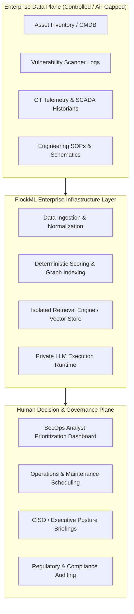

# Enterprise Context & Architecture Overview

> **System Layer:** Enterprise Architecture  
> **Classification:** Public Reference Architecture  
> **Status:** Architected & Designed

---

## 1. System Mission & Context

FlockML Enterprise provides a sovereign, private AI infrastructure and intelligence layer designed to execute analytical workloads against controlled enterprise data. 

In regulated industrial environments—such as power utilities (e.g., CESC), transmission operators, healthcare networks, and critical national infrastructure—operational data cannot be dispatched to multi-tenant public cloud APIs due to statutory sovereignty, national security directives (e.g., CEA regulations, CERT-In cybersecurity guidelines), and strict data residency mandates.

FlockML Enterprise acts as the intermediary execution plane between **Raw Enterprise Assets** and **Human Decision Makers**:

---

## 2. Fundamental Architectural Tenets

1. **Enterprise Data Remains Inside the Perimeter:**  
   The primary tenet is that the model travels to the data, not the data to the model. Inferences, embeddings, and mathematical rankings occur strictly within the enterprise's authorized host environment.
2. **Deterministic Baseline Before Stochastic Reasoning:**  
   Raw enterprise facts (e.g., CVE scores, network zones, patch deadlines) are processed by deterministic, rule-based engines first. The generative/LLM component acts as an explanation and synthesis layer over grounded facts—never as a hallucinated single source of truth.
3. **Modular Subsystem Decoupling:**  
   The ingestion, retrieval, scoring, and explanation layers communicate via strongly typed contracts. Ingestion can ingest from Tenable, Qualys, or flat CSVs without modifying the underlying risk scoring mathematics.
4. **Zero Proprietary Leakage:**  
   The enterprise interface communicates with inference runtimes via standard, portable protocols (e.g., REST/gRPC/CLI). No proprietary distributed worker implementations are required for public-facing reference integration.

---

## 3. High-Level Subsystem Breakdown

| Subsystem | Function | Primary Artifacts / Tech |
|---|---|---|
| **Ingestion Layer** | Sanitizes, validates, and normalizes unstructured and structured enterprise dumps. | CSV/JSON parsers, referential schema validators. |
| **Deterministic Risk Engine** | Computes baseline multi-factor exposure scores using transparent mathematical formulas. | Deterministic scoring runtime (TypeScript/Node.js). |
| **Retrieval / Context Builder** | Selects high-risk records and contextualizes them into structured schemas. | Structured graph indexing, Level 1 RAG context packagers. |
| **Reasoning / Explanation Layer** | Synthesizes grounded natural-language explanations with explicit citations. | Local quantized language models (Llama-3/Mistral) or deterministic templating. |
| **Audit & Governance Engine** | Generates tamper-evident execution logs of every ranking decision and analyst query. | JSONL append-only audit trail with SHA-256 integrity hashes. |
