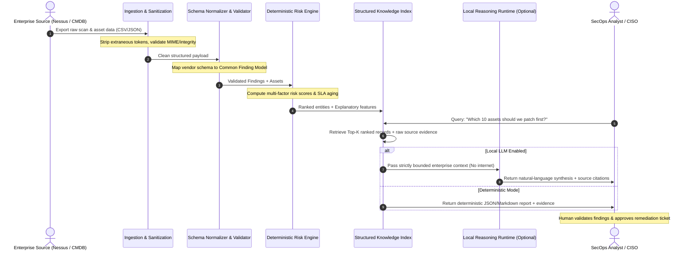

# Enterprise Data Flow Architecture

> **Document Classification:** Public Reference Architecture  
> **Target Audience:** Security Architects, Integration Engineers, Data Engineers  
> **Status:** Architected & Validated on Synthetic Pipelines

---

## 1. End-to-End Information Pipeline

The FlockML Enterprise pipeline enforces a strict unidirectional flow of operational data. Uncontrolled raw data is never exposed directly to external models or unvetted interfaces. Every transformation is deterministic, inspectable, and auditable.

---

## 2. Pipeline Stages in Detail

### Stage 1: Ingestion & Boundary Sanitization
* **Source:** Enterprise vulnerability scanner exports (Tenable Nessus `.nessus`/CSV, Qualys XML/CSV, Rapid7 JSON) and CMDB extracts.
* **Function:** File integrity verification (SHA-256), MIME-type enforcement, character encoding normalization (UTF-8), and stripping of non-printable control characters.
* **Security Control:** Prevents malformed file exploitation and potential parser buffer overflow vectors.

### Stage 2: Schema Normalization & Entity Resolution
* **Function:** Ingested entities are resolved against the **Common Security Finding Schema**:
  * Resolves vendor-specific severity terms (e.g., "Critical", "Sev 5", "High Risk") to standard CVSS v3.1 numeric values.
  * Correlates scanner target identifiers (IP, FQDN, MAC) to the authoritative enterprise Asset ID.
  * Flags unmapped assets or orphans (findings without registered asset records).

### Stage 3: Deterministic Risk Engine Execution
* **Function:** Executes multi-factor composite risk scoring across all active findings:
  $$\text{Asset Risk Score} = \sum_{\text{findings}} \left[ (\text{CVSS} \times W_{\text{zone}}) + \text{Crit} + \text{Exp} + \text{InTheWild} + \text{Overdue} \right]$$
* **Determinism Guarantee:** Given an identical input dataset and scoring configuration, the output ranking is mathematically identical every single run.

### Stage 4: Structured Knowledge Indexing
* **Function:** Indexes findings, assets, and CVE definitions into an in-memory graph / relational tabular index.
* **Traceability:** Every node maintains bidirectional pointers between `Asset_ID`, `CVE_ID`, `Finding_ID`, and `Scanner_Source`.

### Stage 5: Context Retrieval & Prompt Packaging (Level 1 RAG)
* **Function:** When an analyst executes a natural language query, the retrieval engine filters the structured index for exact relevant records.
* **Context Bounding:** The prompt injected into the reasoning runtime contains *only* the retrieved enterprise records. The model is explicitly instructed via system boundaries to decline answering any question not supported by the injected context.

### Stage 6: Human Decision & Ticket Dispatch
* **Function:** The resulting analysis presents prioritized assets, exact citations, confidence scores, and recommended actions.
* **Human-in-the-Loop:** An authorized human analyst inspects the evidence, overrides weights if operational conditions dictate (e.g., scheduled outage), and exports tickets to enterprise ITSM (ServiceNow/Jira).
