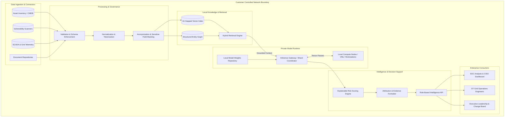

# Enterprise Architecture Specification

## Overview

The **FlockML Enterprise Architecture** establishes a modular, zero-trust infrastructure stack for private AI execution. The system cleanly decouples enterprise data sources from the underlying model runtime, ensuring that proprietary corporate knowledge remains under administrative control while enabling high-throughput inference across heterogeneous hardware.

---

## High-Level Architecture Diagram

---

## Component Architecture Details

### 1. Data Ingestion & Integration Layer
- **Supported Formats:** Structured feeds (CSV, JSON, Parquet), database extracts (PostgreSQL, Oracle, SQL Server), and security scanner exports (Qualys XML/JSON, Tenable .nessus, OpenVAS).
- **Network Mode:** Read-only passive ingestion. Connectors operate in shadow mode and never issue administrative or state-altering commands to enterprise operational equipment.

### 2. Processing & Normalization Layer
- **Schema Validation:** Verifies mandatory fields (e.g., `asset_id`, `cvss_score`, `network_zone`).
- **Data Hygiene:** Strips private network credentials, non-essential personal identifiers, and malformed strings before indexing.
- **Deduplication:** Merges identical scanner findings across overlapping discovery cycles.

### 3. Knowledge & Retrieval Layer (RAG)
- **Local Embedding Generation:** Generates vector representations on-premises using lightweight, air-gapped embedding models.
- **Hybrid Retrieval:** Combines exact keyword BM25 filtering (for CVE identifiers and asset hostnames) with dense vector search (for semantic descriptions and operational contexts).
- **Access Gating:** Enforces role-based access control (RBAC) at the retrieval level so users only retrieve records authorized for their security clearance.

### 4. Private Model Runtime Layer
- **Weight Decoupling:** Model parameters (e.g., Llama, SmolLM, Qwen) remain immutable, pre-evaluated weight files loaded within the customer boundary.
- **Zero Cloud Egress:** All forward inference passes execute locally on enterprise virtual machines, dedicated servers, or pooled workstation compute.
- **Stateless Operation:** Prompt context buffers are zeroized from memory immediately upon completion of the inference pass.

### 5. Intelligence API & Decision Support Layer
- **RESTful Endpoints:** Standardized JSON endpoints for querying prioritized assets, posture summaries, and root-cause explanations.
- **Traceability Engine:** Every response packages the exact source record IDs, timestamps, and confidence score used during analysis.
- **Audit Logging:** Emits immutable, timestamped audit entries compatible with enterprise SIEM solutions (Splunk, Elastic, Sentinel).
