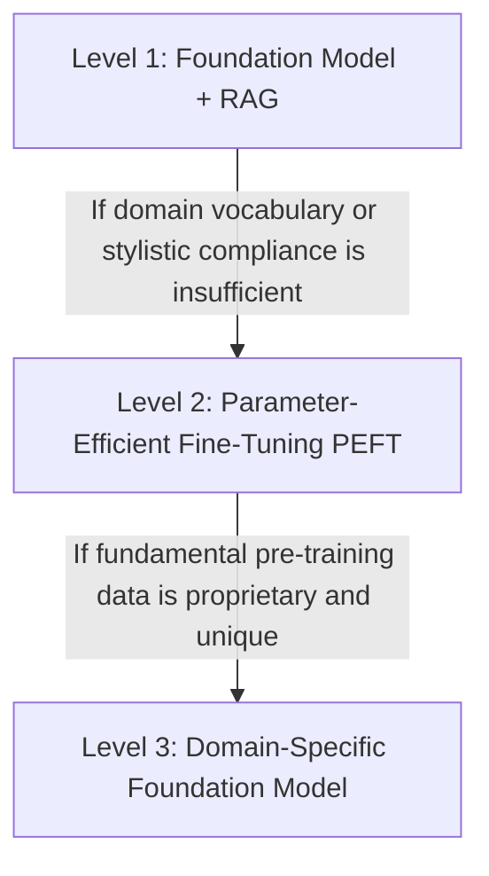

# Enterprise Model Strategy

## 1. Architectural Philosophy: The 3-Tier Model Strategy

FlockML Enterprise decouples model reasoning from enterprise knowledge. Organizations are not required—and generally advised against—immediately training or fine-tuning massive models from scratch.

Instead, FlockML structures enterprise model adoption into three distinct, maturity-based tiers:

---

## 2. Model Maturity Tiers

### Level 1: Foundation Model + Retrieval-Augmented Generation (RAG)
- **Status:** **RECOMMENDED DEFAULT FOR INITIAL POC & PILOTS**
- **Architecture:** Pre-evaluated, static open-weights foundation models (e.g., Llama 3.1 8B, SmolLM2 1.7B, Qwen 2.5 7B/14B) deployed locally alongside an air-gapped vector retrieval index.
- **Why Level 1 is Superior for Proofs-of-Concept:**
  1. **Source Data Control:** Enterprise data remains in the customer's controlled database or index. It is never baked into immutable neural weights.
  2. **Instant Data Updates:** When a vulnerability is patched or an asset is re-zoned, the index updates in seconds without needing a 24-hour training run.
  3. **Zero Weight Contamination:** Impossible for the model to accidentally leak confidential prompts or credentials across unauthorized user sessions.
  4. **Cost Efficiency:** Requires zero expensive training GPU clusters; inference runs on existing private enterprise VMs or standard compute.
  5. **Verifiable Auditability:** The model cites the exact ingested record IDs and timestamps for every assertion.

---

### Level 2: Foundation Model + Enterprise Fine-Tuning (PEFT / LoRA)
- **Status:** **EVALUATION-GATED EXTENSION**
- **When Appropriate:** Adopted only when quantitative evaluation demonstrates that Level 1 (RAG + Prompt Engineering) cannot consistently parse idiosyncratic internal taxonomy, proprietary electrical engineering schemas, or specialized shorthand.
- **Architecture:** Low-Rank Adaptation (LoRA) or QLoRA applied strictly to modular adapter layers while preserving the frozen base model weights.
- **Governance:** Adapters undergo strict regression testing to ensure no loss of general reasoning capabilities.

---

### Level 3: Domain-Specific Foundation Model
- **Status:** **FUTURE STRATEGIC ROADMAP**
- **When Appropriate:** Multi-year institutional deployments where an entire sector (e.g., national power transmission or defense networks) requires a dedicated base model pre-trained on millions of proprietary telemetry tokens under sovereign government sponsorship.

---

## 3. Model-Agnostic Selection Criteria

FlockML Enterprise does not hardcode reliance on any single model vendor or architecture. The runtime supports open-weight architectures evaluated against these empirical criteria:

| Evaluation Criteria | Enterprise Metric | Selection Target |
| :--- | :--- | :--- |
| **Quantization Stability** | Perplexity loss at INT8 / FP8 vs FP16 | < 1.5% perplexity degradation |
| **Context Window** | Usable token capacity without attention drift | &ge; 8,192 to 32,768 tokens |
| **Inference Latency** | Time to First Token (TTFT) and throughput | < 500ms TTFT; &ge; 15–30 tokens/sec |
| **Hardware Footprint** | Memory requirement per model instance | Fits within available VM RAM (e.g., < 16GB for 8B-Q4) |
| **Licensing Compliance** | Commercial use & air-gapped distribution | Apache 2.0, MIT, or Permissive Enterprise License |
