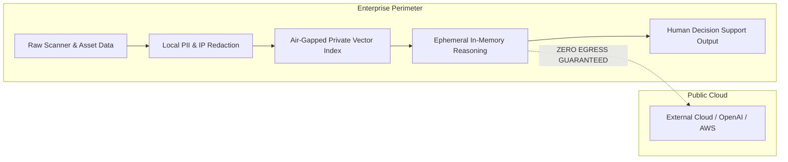

# Enterprise Privacy & Data Protection Architecture

## 1. Regulatory Context & Sovereign Data Protection

Enterprises operating critical national infrastructure (power generation and distribution, defense, banking, healthcare) face strict legal mandates regarding data residency and privacy:
- **Digital Personal Data Protection (DPDP) Act 2023 (India):** Mandates that sensitive personal, operational, and critical infrastructure data be stored and processed in compliance with strict territorial sovereignty rules.
- **Central Electricity Authority (CEA) Cybersecurity Guidelines:** Legally prohibits transmitting high-frequency power grid telemetry, substation topologies, or operational vulnerability logs to third-party public cloud providers.
- **General Data Protection Regulation (GDPR / Global Equivalents):** Enforces data minimization, purpose limitation, and the right to audit automated data processing.

---

## 2. Architectural Privacy Guarantees

### 2.1 Principle of Purpose Limitation
FlockML Enterprise ingests enterprise records exclusively to answer verified business and operational intelligence queries. Ingested data is never used to:
- Train or improve public foundation models
- Share threat indicators or asset vulnerability states across different enterprise tenants
- Expose operational data to external telemetry collectors

### 2.2 Pre-Ingestion Data Minimization
Before raw security scanner exports are indexed:
1. Non-essential fields (such as local usernames, irrelevant network metadata, and internal passwords) are stripped.
2. IP addresses can be replaced with pseudonymous enterprise asset tokens (`AST-XXX`) during staging trials if required by corporate privacy officers.

### 2.3 Ephemeral Processing & Memory Zeroization
- Forward tensor passes and intermediate context windows exist exclusively in volatile memory (RAM / VRAM).
- Immediately upon completion of a decision-support query, context buffers are overwritten with zeros, preventing memory extraction attacks from cold-boot or memory inspection vectors.

### 2.4 Verifiable Data Purge
When a proof-of-concept (POC) concludes or an asset is decommissioned, FlockML provides an automated data eradication tool that cryptographically wipes local indexes and emits a signed certificate of data destruction.
