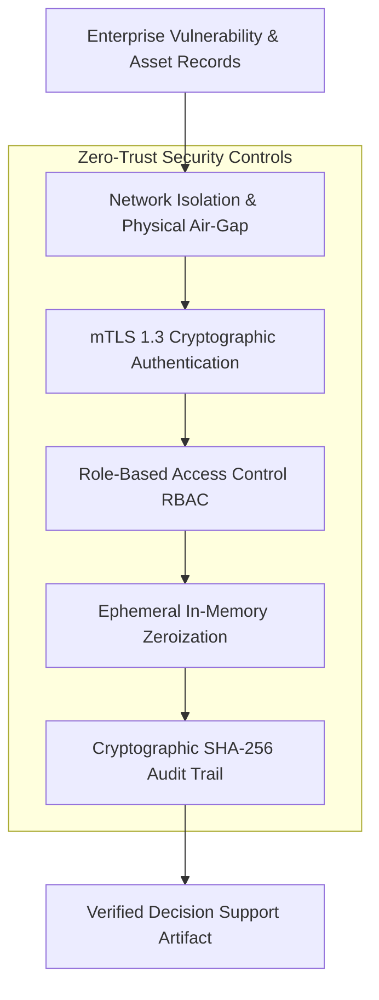

# Enterprise Security Architecture

## 1. Security Philosophy: Defense in Depth

FlockML Enterprise is designed under a strict **zero-trust and zero-egress** model. Enterprise systems and proprietary datasets must be protected by mathematical and architectural guarantees rather than administrative promises.

> **Compliance Notice:** Formal regulatory certifications (e.g., ISO 27001, SOC 2 Type II, CERT-In Level 3) must be evaluated against the final, physical deployment environment and applicable corporate policies. This document specifies the reference security controls engineered into the platform architecture.

---

## 2. Core Security Controls

### 2.1 Data Residency & Network Isolation
- **100% On-Premises Boundary:** The reference platform is designed to operate entirely within an air-gapped Local Area Network (LAN), private Virtual Machine (VM) cluster, or isolated Virtual Private Cloud (VPC).
- **Zero External Telemetry:** The runtime initiates no outbound connections to public package registries, foreign model hubs, or external telemetry endpoints.
- **Physical Verification:** Enterprises can validate zero-egress compliance by placing physical network taps (e.g., Wireshark sensors) on the deployment subnet.

### 2.2 Transport & Rest Cryptography
- **In-Transit Encryption:** All inter-node and inter-service communications mandate TLS 1.3 with mutual authentication (mTLS) and ephemeral session keys.
- **At-Rest Encryption:** Local vector caches and temporary data partitions mandate AES-256-GCM encryption with enterprise-managed key infrastructure (KMS / HSM).

### 2.3 Ephemeral Memory Management & Retention
- **No Residual Context:** Inference buffers and activation tensors are purged from memory immediately following completion of the inference pass.
- **No Weight Contamination:** Raw enterprise prompts are never cached within model checkpoints or used for continuous background gradient updates.

### 2.4 Cryptographic Auditability
- Every decision-support query, retrieved record set, and scoring calculation generates an immutable, SHA-256 hash-chained audit record.
- Audit records include timestamp, executing user ID, model hash, source document hashes, and response confidence.

---

## 3. Threat Modeling & Specific Mitigations

| Threat Vector | Potential Impact | FlockML Reference Mitigation |
| :--- | :--- | :--- |
| **Prompt Injection** | Adversary crafts inputs to bypass safety bounds | Strict separation of control instructions and retrieved enterprise data; input validation and structural escaping before LLM context ingestion. |
| **Retrieval Poisoning** | Malicious or forged records inserted into index | Cryptographic hash verification of source scanner exports; role-gated ingest validation before indexing. |
| **Model Hallucination** | System asserts non-existent vulnerabilities | Mandatory citation requirement; every claimed risk must link directly to an existing `finding_id` and `cve_id` from the source catalog. |
| **Sensitive Data Leakage** | Confidential hostnames or IPs leaked across tenants | RBAC enforcement at the retrieval stage; automated pre-ingest masking of unnecessary credentials and sensitive identifiers. |
| **Compromised Worker Node** | Untrusted worker returns fraudulent analysis | Cryptographic activation tracking and deterministic reference verification; workers with anomalous outputs are quarantined. |
| **Supply Chain Vulnerability** | Compromised third-party dependencies | Zero external runtime dependencies in core ingestion and scoring; pinned, vetted dependencies for tooling with automated vulnerability scanning. |

---

## 4. Human-in-the-Loop Governance

FlockML Enterprise explicitly disallows autonomous destructive actions.
- **Decision Support Only:** The system ranks vulnerabilities, explains attack exposure, and drafts remediation recommendations.
- **Human Approval Gate:** All patch installations, firewall rule modifications, and system reboots must be executed by authorized enterprise human personnel through standard Change Advisory Board (CAB) workflows.
