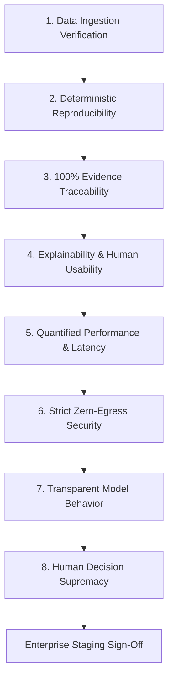

# Enterprise POC Acceptance Criteria

> **Document Classification:** Acceptance Testing Protocol  
> **Status:** Formal Gate Criteria for Enterprise POC Sign-Off

---

## 1. Governance & Gating Framework

To transition from the initial reference proof-of-concept to a controlled enterprise staging pilot, FlockML Enterprise must satisfy eight non-negotiable acceptance criteria. Each criterion must be formally tested, documented, and signed off by designated enterprise stakeholders.

---

## 2. The Eight Formal Acceptance Criteria

### 1. Ingestion of Enterprise Vulnerability Data
* **Requirement:** The system successfully ingests, validates, and normalizes standard scanner exports (CSV/JSON from Tenable, Qualys, or Rapid7) and CMDB asset registers without schema breakage or data truncation.
* **Verification:** Ingestion test suite confirms 100% of valid records parsed; invalid or orphan rows flagged with descriptive error logs.

### 2. Deterministic Ranking Reproducibility
* **Requirement:** Running the scoring engine repeatedly against an identical dataset and configuration produces mathematically identical rankings, scores, and sorting orders every single time.
* **Verification:** Three consecutive execution runs yield zero variance in output hashes ($\Delta = 0$).

### 3. Complete Evidence Traceability
* **Requirement:** Every prioritized asset, score component, and risk factor is directly traceable to specific source records (Asset ID, CVE ID, Finding ID, and scanner timestamp).
* **Verification:** Schema audit verifies that 100% of ranked output records include valid pointers to ingested source rows.

### 4. Explainability for Security Analysts
* **Requirement:** Security analysts can clearly understand *why* an asset was ranked above another through human-readable, multi-factor risk breakdowns (e.g., CVSS severity, internet exposure, OT zone criticality, active exploit, and overdue SLA).
* **Verification:** SOC analyst review confirms explanations are transparent, self-explanatory, and free of ambiguous technical jargon.

### 5. Quantified & Measurable Latency
* **Requirement:** Processing latency for deterministic triage and query response is precisely measured and falls within agreed operational bounds.
* **Verification:** End-to-end processing of 1,000 findings executes in < 200 milliseconds on standard enterprise VM hardware.

### 6. Strict Zero-Egress Security Isolation
* **Requirement:** No enterprise data, findings, asset identifiers, or query logs leave the approved private network perimeter.
* **Verification:** Network interface packet capture (`tcpdump`) and enterprise firewall egress logs confirm zero external network connections or outbound DNS queries.

### 7. Transparent Model Behavior (Zero Uncontrolled Hallucination)
* **Requirement:** If an optional local LLM synthesis layer is enabled, it must restrict its reasoning strictly to the provided enterprise context. It must decline to answer out-of-domain queries and never invent non-existent vulnerabilities or assets.
* **Verification:** Injected adversarial test prompts (asking about fictional assets or CVEs) return explicit disclaimer notices rather than hallucinated facts.

### 8. Human-in-the-Loop Decision Supremacy
* **Requirement:** The system functions strictly as decision support. It must not execute autonomous network commands, modify firewalls, alter master databases, or push patches without explicit human authorization.
* **Verification:** Code audit and architectural review confirm zero write-access integrations to production network interfaces.
