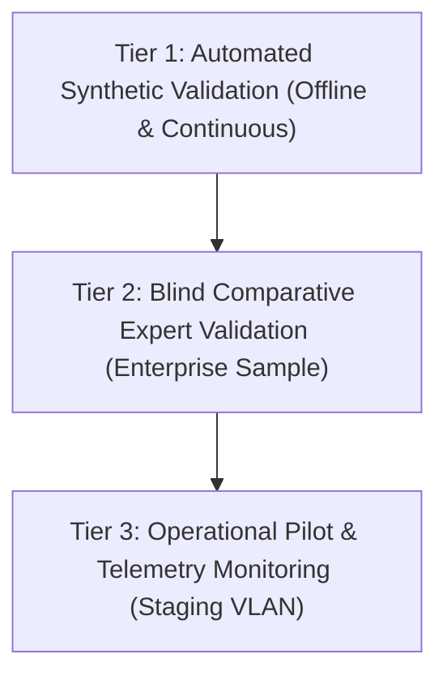

# Evaluation Methodology

> **Document Classification:** Enterprise Evaluation Standard  
> **Governing Principle:** Prove, Don't Promise  
> **Status:** Standardized Protocol

---

## 1. Evaluation Philosophy & Rigor

Enterprise artificial intelligence must not be procured or deployed on subjective impressions, vendor marketing claims, or ungrounded synthetic benchmarks. FlockML Enterprise mandates a **Three-Tier Evaluation Framework** to establish empirical proof of efficacy, determinism, and security before any production deployment:

---

## 2. The Three-Tier Evaluation Framework

### Tier 1: Automated Synthetic Validation
* **Execution:** Fully automated unit, integration, and referential integrity test suites executed in continuous integration.
* **Scope:** 
  * Mathematical correctness of risk formulas across edge cases (e.g., zero CVSS, unmapped assets, expired SLAs).
  * 100% referential integrity across assets, CVEs, and findings.
  * Regression testing against fixed synthetic datasets (`/examples/security-intelligence`).
* **Validation Standard:** Zero test failures, zero memory leaks, sub-second execution.

### Tier 2: Blind Comparative Expert Validation
* **Execution:** Conducted during Stage 2 of an enterprise POC using a sample export of enterprise vulnerability records (e.g., 500–1,000 findings).
* **Protocol:**
  1. A senior enterprise security engineer / SOC lead manually triages the findings and establishes an authoritative **Top-10 Priority List** with documented rationale.
  2. Simultaneously, FlockML Enterprise ingests the identical dataset and generates its deterministic Top-10 ranking and explanations.
  3. An independent evaluator calculates the **Concordance Score (Spearman's Rank Correlation $\rho$)** between the human expert and the FlockML engine.
* **Target Metric:** $\rho \ge 0.80$ with 100% agreement on critical internet-facing OT assets.

### Tier 3: Operational Pilot & Telemetry Monitoring
* **Execution:** Deployed in an isolated staging VM running in parallel with existing manual SecOps workflows for 30 days.
* **Scope:**
  * Reduction in Mean Time to Prioritize (MTTP).
  * System resource consumption (vCPU, RAM, disk I/O).
  * Network boundary verification (zero unauthorized egress packets).
  * Analyst satisfaction and feedback loops.

---

## 3. Ground Truth & Validation Status Taxonomy

To eliminate ambiguity, all capabilities, benchmarks, and architectural claims throughout FlockML documentation must be explicitly categorized using the following six-state taxonomy:

| Status Identifier | Meaning | Evidence Standard |
|---|---|---|
| **IMPLEMENTED** | Code exists, executes locally, and is directly verifiable. | Runnable source code in this repository. |
| **VALIDATED AUTOMATICALLY**| Passing automated test suite with deterministic assertions. | Passing CI test runs (`npm test`, `npm run validate:data`). |
| **PHYSICALLY VALIDATED** | Verified on physical bare-metal hardware or enterprise infrastructure. | Documented hardware test reports and operational metrics. |
| **PROPOSED** | Architected and designed specification ready for pilot testing. | Complete technical design document without production deployment. |
| **EXPERIMENTAL** | Proof-of-concept code under active research; subject to breaking changes. | Code located in designated experimental branch or module. |
| **FUTURE** | Long-term architectural roadmap item. | Conceptual description in product roadmap. |

> [!CAUTION]
> If a performance metric, integration interface, or deployment state is not empirically known, the only permissible documentation phrase is:  
> **"To be validated during POC"**
