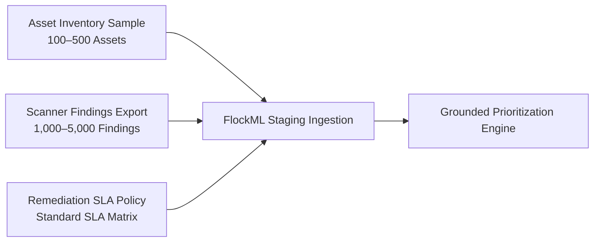

# POC Data Requirements & Schema Standards

To evaluate the FlockML Enterprise Security Intelligence POC, the enterprise provides a sample export of network vulnerability and asset records into the isolated staging environment.

> **Data Protection Guarantee:** All data provided for the POC remains strictly confined to the customer-provided virtual machine environment. Zero records will be transferred off-premises.

---

## 1. Required Datasets

### Dataset 1: Asset Inventory Export
A sample inventory containing between 100 and 500 representative physical and virtual systems across corporate IT and operational monitoring subnets:
- **Mandatory Fields:**
  - `asset_id`: Internal asset tag or unique identifier (can be anonymized, e.g., `AST-001`).
  - `asset_name`: Hostname or functional descriptor.
  - `criticality`: Business impact rating (`CRITICAL`, `HIGH`, `MEDIUM`, `LOW`).
  - `network_zone`: Segmentation tier (e.g., `OT-CONTROL-ZONE`, `OT-DMZ`, `IT-CORPORATE`, `EXTERNAL-DMZ`).
  - `internet_exposed`: Boolean flag (`TRUE` / `FALSE`) indicating public accessibility.
- **Optional/Enrichment Fields:**
  - `operating_system`: OS name and kernel/build version.
  - `owner_unit`: Departmental owner (e.g., `Grid Operations`, `Commercial IT`).
  - `location`: Substation designation or data center facility.

---

### Dataset 2: Vulnerability Scanner Findings Export
A standard export file from enterprise vulnerability discovery tools (Tenable, Qualys, Rapid7, or OpenVAS) containing recent scan detections:
- **Mandatory Fields:**
  - `finding_id`: Unique scan detection identifier.
  - `asset_id`: Matching foreign key identifier from Dataset 1.
  - `cve_id`: Standard MITRE CVE identifier (e.g., `CVE-2024-6387`).
  - `cvss_score`: Base severity numeric score (`0.0` to `10.0`).
  - `first_seen_date`: Date when vulnerability was initially detected.
  - `status`: Current finding state (`OPEN`, `IN_PROGRESS`).
- **Optional/Enrichment Fields:**
  - `affected_service`: Port and service banner (e.g., `22/tcp OpenSSH 8.9p1`).
  - `scanner_source`: Sensor designation or scanner tool identifier.

---

### Dataset 3: Enterprise Patching SLA Matrix
Standard organizational remediation deadlines:
- `CRITICAL` Severity: Policy-mandated resolution window (e.g., 7–14 calendar days).
- `HIGH` Severity: Policy-mandated resolution window (e.g., 30 calendar days).
- `MEDIUM` Severity: Standard scheduled maintenance window (e.g., 60–90 calendar days).
