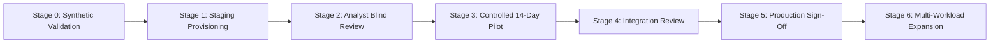

# Proposed Staged Adoption Roadmap (Stage 0 to Stage 6)

## Overview

The proposed proof-of-concept is structured across seven discrete, evaluation-gated stages designed to minimize enterprise operational disruption and prevent premature exposure of production infrastructure.

---

## Stage Breakdown

### Stage 0: Synthetic Baseline Validation
- **Objective:** Validate the platform architecture and scoring algorithms using purely synthetic data before requesting enterprise resources.
- **Inputs:** Synthetic datasets provided in this repository.
- **Deliverables:** Architectural validation of multi-factor risk formulas and synthetic schemas.
- **Security Boundary:** Public repository specification.
- **Status:** **COMPLETED**

---

### Stage 1: Staging VM Provisioning & Environment Setup
- **Objective:** Deploy the FlockML reference engine on private virtual machines inside the customer’s isolated data center subnet.
- **Duration:** Days 01–03.
- **Inputs:** 1–2 private Linux virtual machines allocated by IT infrastructure team.
- **Deliverables:** Running engine instance reachable only over local corporate HTTPS.
- **Security Boundary:** Private internal staging VLAN; zero internet egress.
- **Exit Criteria:** Physical Wireshark audit confirms zero outbound network packets.

---

### Stage 2: Sample Dataset Ingestion & Blind Analyst Review
- **Objective:** Ingest an initial sample of 100–300 anonymized enterprise scanner records and execute blind evaluation against senior analyst rankings.
- **Duration:** Days 04–07.
- **Inputs:** One sanitized scanner export and asset criticality sample.
- **Deliverables:** Model-generated Top-10 prioritized asset list with causal explanations.
- **Security Boundary:** Ingested data remains encrypted in VM volatile memory.
- **Exit Criteria:** &ge;90% concordance between model ranking and senior SecOps lead ranking.

---

### Stage 3: Controlled 14-Day Staging Pilot
- **Objective:** Evaluate operational triage performance against ongoing weekly vulnerability discovery scans.
- **Duration:** Days 08–14.
- **Inputs:** Weekly vulnerability discovery exports.
- **Deliverables:** Automated weekly vulnerability delta briefings and actionable patch prioritization queues.
- **Security Boundary:** Isolated staging subnet.
- **Exit Criteria:** CISO and SecOps team confirm measured reduction in triage overhead (>70% time saved).

---

### Stage 4: Enterprise Integration Evaluation
- **Objective:** Assess technical feasibility of integrating read-only connectors directly to enterprise CMDB and SIEM platforms (e.g., Splunk, ServiceNow).
- **Deliverables:** Architectural integration blueprint and security sign-off.

---

### Stage 5: Production Architecture & Executive Sign-Off
- **Objective:** Formal technical sign-off by Chief Information Officer (CIO) and Chief Information Security Officer (CISO) for production deployment.

---

### Stage 6: Expansion to Multi-Workload Enterprise Intelligence
- **Objective:** Leverage the same deployed on-premises AI infrastructure to power additional operational use cases (Predictive Maintenance, Operational Intelligence, Document Intelligence).
