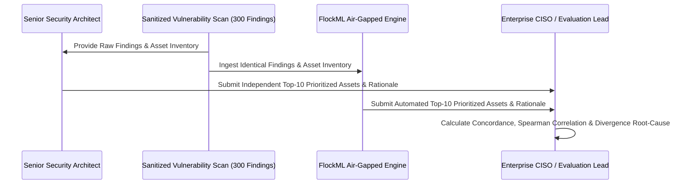

# POC Evaluation Plan & Blind Comparison Protocol

## 1. Objective

To provide an objective, empirical evaluation of the FlockML Security Intelligence engine’s prioritization accuracy by comparing its automated outputs against the independent judgments of senior enterprise security architects.

---

## 2. The Blind Comparison Protocol

To eliminate bias, the evaluation employs a double-blind validation methodology:

1. **Step 1: Dataset Partitioning:** The enterprise security team prepares an export of 300 real, anonymized vulnerability findings across 50–100 assets.
2. **Step 2: Human Ground Truth Generation:** A senior enterprise security architect independently reviews the dataset and creates a ranked list of the Top-10 assets requiring immediate remediation, documenting their technical rationale.
3. **Step 3: Automated Model Scoring:** The FlockML engine ingests the identical dataset in the isolated staging VM and computes its Top-10 ranked assets with transparent score breakdowns.
4. **Step 4: Statistical Comparison:** The CISO or evaluation lead compares the two lists using predefined mathematical metrics.

---

## 3. Statistical Evaluation Metrics

| Metric | Calculation Method | Target Threshold for Success |
| :--- | :--- | :--- |
| **Top-10 Overlap Ratio** | $\frac{|\text{Top10}_{\text{Human}} \cap \text{Top10}_{\text{Model}}|}{10}$ | **&ge; 80% (At least 8 of 10 assets identical)** |
| **Top-5 Strict Concordance** | Exact rank matching within Top-5 highest risk assets | **&ge; 4 of 5 assets identical** |
| **Spearman Rank Correlation ($\rho$)** | Statistical correlation of ranked positions across overlapping assets | **$\rho \ge 0.85$ (Strong positive correlation)** |
| **False Prioritization Rate** | Assets ranked in Top-10 that senior analyst rates as Low/Negligible | **0.0%** |
| **Evidence Traceability** | Automated verification that all cited CVEs exist in raw scanner feed | **100.0% Traceable** |

---

## 4. Discrepancy Resolution Protocol

If the model and human analyst diverge on an asset's ranking:
1. The Arbiter reviews the deconstructed score breakdown produced by FlockML.
2. If the divergence occurred because the model detected an overlooked perimeter exposure (e.g., an internet-facing gateway interface) or an active exploit code listing that the human analyst missed, the model's prioritization is recorded as a **valid predictive insight**.
3. If the divergence occurred due to unrepresented contextual factors (e.g., an undocumented compensating hardware firewall), that finding is used to calibrate the enterprise-specific weight parameters.
