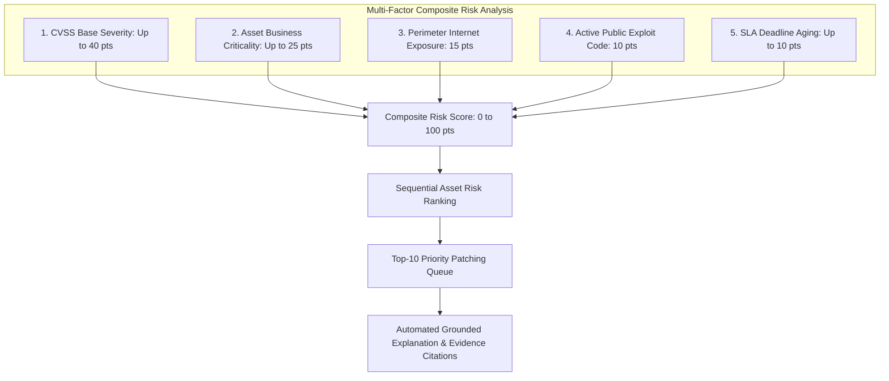

# Security Intelligence Engine: Functional Specification

## 1. Core Engine Capabilities

The proposed Security Intelligence engine operates on a deterministic, multi-factor risk model supplemented by grounded natural language reasoning.

---

## 2. Multi-Factor Scoring Formula

$$\text{Composite Risk Score} = S_{\text{CVSS}} + C_{\text{Asset}} + E_{\text{Perimeter}} + X_{\text{Exploit}} + A_{\text{SLA}}$$

1. **CVSS Severity Factor ($S_{\text{CVSS}}$, 0 to 40 points):**  
   Calculated as $\max(\text{CVSS Base}) \times 4.0$. A CVSS 10.0 critical finding contributes the maximum 40 points.
2. **Asset Criticality Factor ($C_{\text{Asset}}$, 0 to 25 points):**  
   - `CRITICAL` Infrastructure (SCADA servers, substation gateways, core DBs): **25 points**
   - `HIGH` Infrastructure (Regional RTUs, secondary servers): **16 points**
   - `MEDIUM` Infrastructure (Office workstations, auxiliary tools): **8 points**
   - `LOW` Infrastructure (Test/isolated sandbox devices): **2 points**
3. **Perimeter Exposure Factor ($E_{\text{Perimeter}}$, 0 or 15 points):**  
   - `TRUE` (Direct public ingress / external DMZ): **15 points**
   - `FALSE` (Internal network only): **0 points**
4. **Exploit Availability Factor ($X_{\text{Exploit}}$, 0 or 10 points):**  
   - Functional exploit code publicly available or listed on CISA Known Exploited Vulnerabilities (KEV): **10 points**
   - Theoretical / no public exploit code: **0 points**
5. **SLA Aging Factor ($A_{\text{SLA}}$, 0 to 10 points):**  
   - Remediation overdue by >30 days: **10 points**
   - Remediation overdue by 1–30 days: **5 points**
   - Within policy SLA: **0 points**

---

## 3. Explanatory Intelligence & Decision Support

Unlike black-box generative models that output unstructured text, the engine produces **structured attribution packages**:
- **Why an asset was ranked:** Explicitly outputs the points breakdown across each of the 5 factors.
- **Attack surface visualization:** Highlights whether vulnerabilities reside on external gateway interfaces versus internal management ports.
- **Evidence citations:** Cites exact finding IDs, scanner source names, and CVE publication dates so analysts can immediately cross-reference primary logs.
- **Actionable playbooks:** Generates exact package upgrade commands, vendor patch advisory links, and recommended temporary firewall ACL workarounds.
